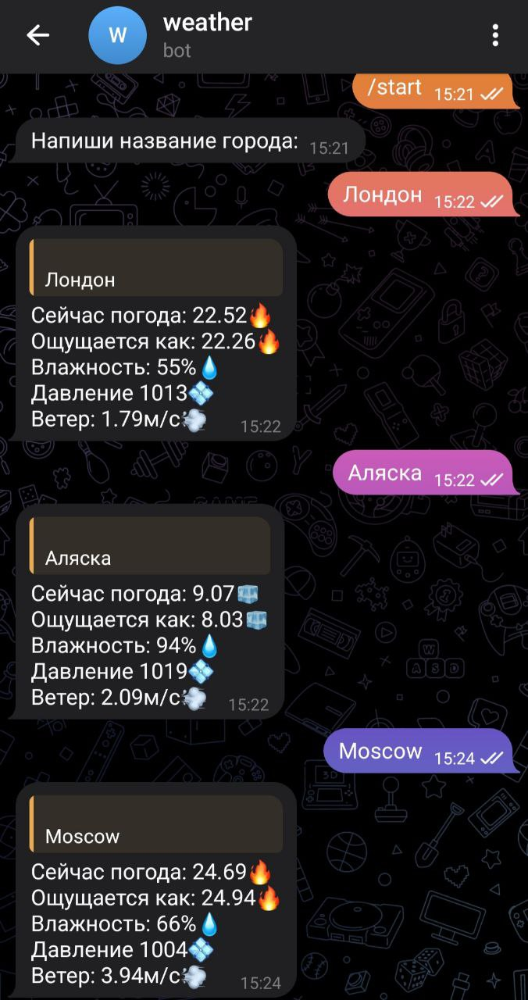

***This project i made for my portfolio but if you want you can run this***
# About
This telegram bot working with currency weather api  
This telegram bot show weather parameters when you send city name  
For this goal i used aogram

### How to run?:

1. You need download requirements:
    `pip install -r requirements.txt`
2. You need to get API:
   * You need to register on currency weather site and get API, then you need to paste API in config.py
   * For telegram bot you need to create a bot with @BotFather in telegram and paste bot API in config.py
3. Now you can run this:
   `python main.py`

## EXAMPLE

